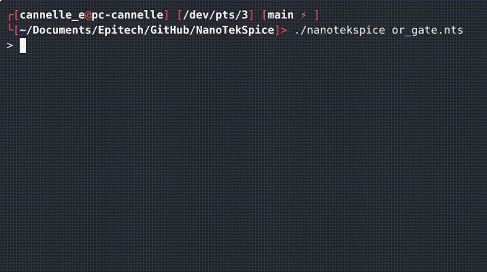
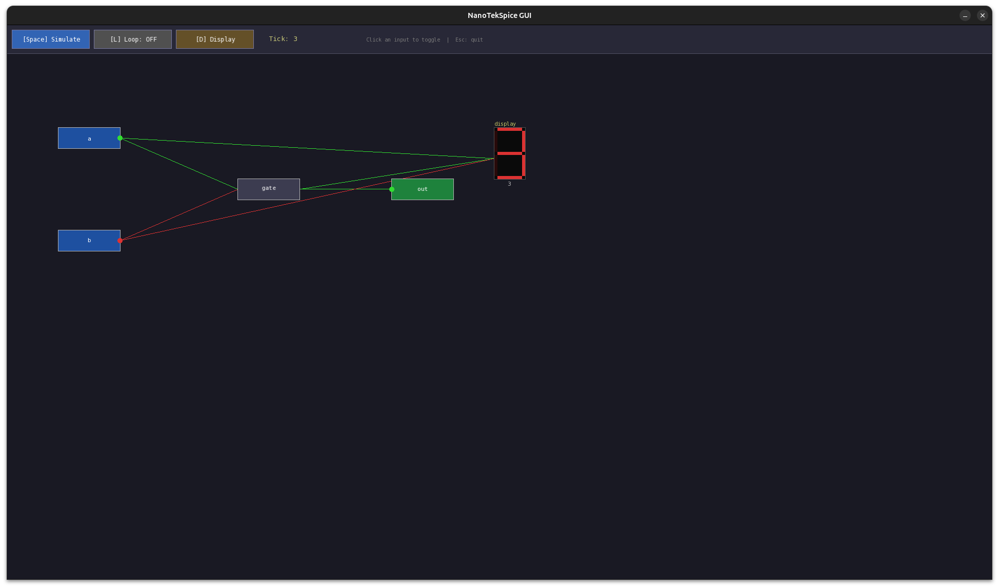
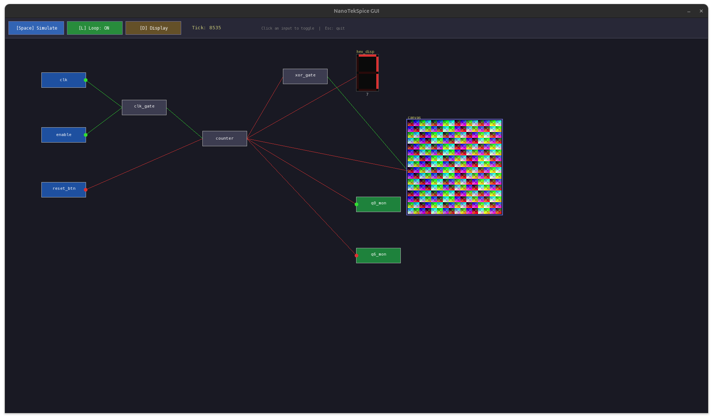
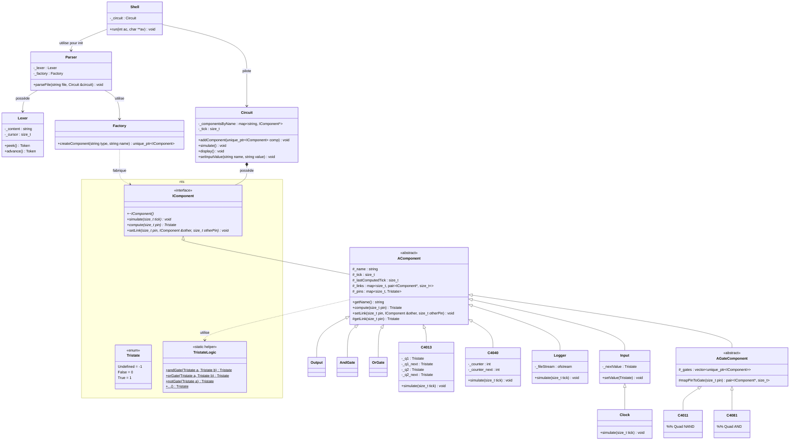

# NanoTekSpice

> Digital circuit simulator based on three-state Boolean logic - EPITECH G-OOP-400 Project

---

## Table of contents
1. [Overview](#overview)
2. [Compilation](#compilation)
3. [Usage](#usage)
4. [The .nts configuration file](#the-nts-configuration-file)
    a) [Section .chipsets:](#section-chipsets)
    b) [Section .links:](#section-links)
    c) [Syntax rules](#syntax-rules)
    d) [Complete example](#complete-example)
5. [Interactive shell](#interactive-shell)
    a) [Session example](#session-example)
    b) [Display format (display)](#display-format-display)
6. [Available components](#available-components)
    a) [Special components](#special-components)
    b) [Elementary gates](#elementary-gates)
    c) [Multi-gate chipsets](#multi-gate-chipsets)
    d) [Advanced components](#advanced-components)
7. [Tristate logic](#tristate-logic)
8. [Project architecture](#project-architecture)
    a) [Class hierarchy](#class-hierarchy)
9. [Bonus - Turing machine](#bonus--turing-machine)
    a) [Standalone simulator](#standalone-simulator)
    b) [The .tm program file](#the-tm-program-file)
    c) [TuringMachine component](#turingmachine-nanotekspice-component)
10. [Bonus - GUI](#bonus--gui)
    a) [Usage](#usage-1)
    b) [Keyboard controls](#keyboard-controls)
    c) [The .graphtc: section](#the-graphtc-section)
    d) [GUI-exclusive components](#gui-exclusive-components)

---

## Overview

**NanoTekSpice** is a digital circuit simulator. From a `.nts` configuration file describing a circuit (components and connections), it builds a component graph, injects values, and simulates the behavior tick by tick.

Components are either real digital chipsets (4081, 4013, 4040…) or logical inputs/outputs. All signals rely on **three-state logic**: `0` (False), `1` (True), and `U` (Undefined).

---

## Screenshots

### Interactive shell



### GUI (SFML)
Example with [test_gui.nts](bonus/examples/test_gui.nts)


Example with [complex_gui.nts](bonus/examples/complex_gui.nts)


---

## Compilation

```sh
# Compile the main project
make

# Clean object files
make clean

# Remove everything (objects + binary)
make fclean

# Recompile from scratch
make re

# Compile and run unit tests (Criterion)
make unit_tests

# Run functional tests
make functional_tests

# Run both test series
make tests_run

# Coverage report on unit tests
make coverage

# Static analysis
make lint

# Memory check (Valgrind)
make memcheck

# Compile the Turing machine bonus
make turing

# Compile the graphic interface bonus
make gui

```

---

## Usage

```sh
./nanotekspice <file.nts>
```

**Example:**

```sh
./nanotekspice nts_single/or.nts
```

The program starts in interactive mode. If the `.nts` file is invalid, an error is displayed on stderr and the program exits with code 84. In general, if an error occurs, error code 84 will be returned.

---

## The `.nts` configuration file

An `.nts` file is divided into two sections:

### Section `.chipsets:`

Declares components using the format `<type> <name>`:

```
.chipsets:
input    a
input    b
4081     andgate
output   out
```

### Section `.links:`

Declares connections between pins using the format `<component>:<pin> <component>:<pin>`. Links are **bidirectional**:

```
.links:
a:1       andgate:1
b:1       andgate:2
andgate:3 out:1
```

### Syntax rules

* Spaces between words can be spaces or tabs.
* Instructions are terminated by a newline.
* Comments start with `#` and can be at the beginning of a line or after an instruction.
* Both `.chipsets:` and `.links:` sections are mandatory.

### Complete example

```
# AND circuit with three inputs
.chipsets:
input    i0
input    i1
input    i2
4081     and0
output   out

.links:
i0:1     and0:1
i1:1     and0:2
and0:3   and0:5
i2:1     and0:6
and0:4   out:1
```

---

## Interactive shell

Once the circuit is loaded, the simulator displays a `> ` prompt and accepts the following commands:

| Command | Description |
| --- | --- |
| `display` | Displays the current tick and the values of all inputs and outputs (sorted by ASCII order) |
| `simulate` | Simulates one tick of the circuit |
| `loop` | Simulates in a loop (`simulate` + `display` continuously) until `CTRL+C` |
| `<name>=<value>` | Changes an input value (`0`, `1`, or `U`) |
| `exit` | Exits the program (code 0) |

> `CTRL+D` at the end of the standard input terminates the program with code 0.

### Session example

```
$ ./nanotekspice or_gate.nts
> b=0
> a=1
> simulate
> display
tick: 1
input(s):
  a: 1
  b: 0
output(s):
  s: 1
> exit
```

### Display format (`display`)

```
tick: <number>
input(s):
  <name>: <value>
output(s):
  <name>: <value>
```

Undefined values are displayed as `U`.

---

## Available components

### Special components

| Type | Pins | Description |
| --- | --- | --- |
| `input` | 1 | User-controlled input. Initial value: `U`. Can be `0`, `1`, `U`. |
| `output` | 1 | Output probe. Displays the calculated value of the connected pin. |
| `clock` | 1 | Like `input`, but its value automatically inverts at each `simulate`. |
| `true` | 1 | Always `1`. |
| `false` | 1 | Always `0`. |
| `logger` | 10 | Writes an 8-bit character to `./log.bin` on the rising edge of CLK when INHIBIT is low. Pins: CLK=9, INHIBIT=10, Data D0–D7 = pins 1–8. |

### Elementary gates

These components represent a single logic gate.

| Type | Pins | Description |
| --- | --- | --- |
| `and` | 1,2 → 3 | AND Gate |
| `or` | 1,2 → 3 | OR Gate |
| `xor` | 1,2 → 3 | XOR Gate |
| `not` | 1 → 2 | Inverter (NOT) |
| `nand` | 1,2 → 3 | NAND Gate |
| `nor` | 1,2 → 3 | NOR Gate |

### Multi-gate chipsets

These chipsets contain multiple gates in a single package (pins 7 and 14 are power supply, ignored).

| Type | Description | Gates |
| --- | --- | --- |
| `4001` | Quad 2-input NOR | 4 NOR gates. Inputs: (1,2)→3, (5,6)→4, (8,9)→10, (12,13)→11 |
| `4011` | Quad 2-input NAND | 4 NAND gates. Inputs: (1,2)→3, (5,6)→4, (8,9)→10, (12,13)→11 |
| `4030` | Quad 2-input XOR | 4 XOR gates. Same layout |
| `4069` | Hex NOT (6 inverters) | 6 inverters. Inputs: 1→2, 3→4, 5→6, 9→8, 11→10, 13→12 |
| `4071` | Quad 2-input OR | 4 OR gates |
| `4081` | Quad 2-input AND | 4 AND gates |

### Advanced components

#### `4008` - 4-bit Full Adder (16 pins)

Adds two 4-bit numbers with carry.

| Pins | Role |
| --- | --- |
| 7, 5, 3, 1 | A0–A3 (first operand) |
| 6, 4, 2, 15 | B0–B3 (second operand) |
| 9 | Cin (Carry in) |
| 10, 11, 12, 13 | Sum0–Sum3 (result) |
| 14 | Cout (Carry out) |

#### `4013` - Dual D-Type Flip-Flop (14 pins)

Two independent D flip-flops, triggered on the rising edge.

| FF | CLK | D | Set | Reset | Q | Q̄ |
| --- | --- | --- | --- | --- | --- | --- |
| FF1 | 3 | 5 | 6 | 4 | 1 | 2 |
| FF2 | 11 | 9 | 8 | 10 | 13 | 12 |

* Asynchronous Set and Reset, active High.

#### `4017` - Johnson Decade Counter (16 pins)

Counts cyclically from 0 to 9, one active output at a time.

| Pins | Role |
| --- | --- |
| 14 | CLK (rising edge) |
| 13 | Clock Inhibit (blocks counting if high) |
| 15 | Reset (resets to 0) |
| 3,2,4,7,10,1,5,6,9,11 | Q0–Q9 (decoded outputs) |
| 12 | Carry Out (pulse when Q9→Q0) |

#### `4040` - 12-bit Binary Counter (16 pins)

Counts on the **falling edge** of the CLK.

| Pins | Role |
| --- | --- |
| 10 | CLK |
| 11 | Reset |
| 9,7,6,5,3,2,4,13,12,14,15,1 | Q0–Q11 (output bits) |

#### `4094` - 8-bit Shift Register (16 pins)

Serial-to-parallel shift on rising edge.

| Pins | Role |
| --- | --- |
| 1 | Strobe (latches parallel output) |
| 2 | Data (serial input) |
| 3 | CLK |
| 15 | Output Enable |
| 4–7, 14–11 | Q0–Q7 (parallel outputs) |
| 9, 10 | Qs, Qe (serial outputs) |

#### `4512` - 8-channel Multiplexer (16 pins)

Selects one of 8 channels.

| Pins | Role |
| --- | --- |
| 11, 12, 13 | A, B, C (address, selects I0–I7) |
| 1–7, 9 | I0–I7 (input data) |
| 10 | Inhibit |
| 15 | Enable |
| 14 | Z (output) |

#### `4514` - 4-to-16 Line Decoder (24 pins)

Activates one of 16 outputs based on a 4-bit address.

| Pins | Role |
| --- | --- |
| 2, 3, 21, 22 | A0–A3 (address) |
| 1 | Strobe (transparent latch) |
| 23 | Inhibit |
| 4–20 | Y0–Y15 (outputs, one active at a time) |

#### `4801` - 1024×8 Static RAM (24 pins)

1 KB (1024 bytes) memory, read/write.

| Pins | Role |
| --- | --- |
| A0–A9 | Address (10 bits) |
| D0–D7 | Data (bidirectional) |
| 18 | CE (Chip Enable) |
| 21 | WE (Write Enable) |
| 20 | OE (Output Enable) |

* Read: CE and OE high.
* Write: CE and WE high.

#### `2716` - 2048×8 EPROM/ROM (24 pins)

2 KB read-only memory, initialized from the `./rom.bin` file at startup.

| Pins | Role |
| --- | --- |
| A0–A10 | Address (11 bits) |
| D0–D7 | Data (output only) |
| 18 | CE |
| 20 | OE |

---

## Tristate logic

NanoTekSpice uses **three-state logic** to simulate the real behavior of incomplete circuits.

| Value | Meaning | Display |
| --- | --- | --- |
| `True` (1) | High Signal / VCC | `1` |
| `False` (0) | Low Signal / 0V | `0` |
| `Undefined` (U) | Undefined Signal | `U` |

### Truth Tables with Undefined State

**AND:**

| A | B | A AND B |
| --- | --- | --- |
| 0 | 0 | 0 |
| 0 | 1 | 0 |
| 0 | U | 0 |
| 1 | 1 | 1 |
| 1 | U | U |
| U | U | U |

**OR:**

| A | B | A OR B |
| --- | --- | --- |
| 0 | 0 | 0 |
| 0 | 1 | 1 |
| 1 | U | 1 |
| 0 | U | U |
| U | U | U |

**XOR:**

| A | B | A XOR B |
| --- | --- | --- |
| 0 | 0 | 0 |
| 0 | 1 | 1 |
| 1 | 0 | 1 |
| 1 | 1 | 0 |
| * | U | U |

**NOT:**

| A | NOT A |
| --- | --- |
| 0 | 1 |
| 1 | 0 |
| U | U |

---

## Project architecture

```
.
├── include/nts/
│   ├── IComponent.hpp          # Base interface for all components
│   ├── AComponent.hpp          # Abstract class implementing IComponent
│   ├── Tristate.hpp            # Tristate Enum (Undefined, False, True)
│   ├── TristateLogic.hpp       # Tristate logic operations
│   ├── Circuit.hpp             # Circuit container and simulation loop
│   ├── Parser.hpp              # .nts file parser
│   ├── Lexer.hpp               # Tokenizer
│   ├── ComponentFactory.hpp    # Factory pattern for component creation
│   ├── Shell.hpp               # Interactive shell
│   ├── Errors.hpp              # Exception hierarchy
│   └── components/             # Headers for each component
├── src/
│   ├── main.cpp
│   ├── core/                   # Parser, Lexer, Circuit, Shell implementations...
│   └── components/             # Implementations for each component
├── bonus/                      # Bonus: Turing Machine and GUI (see dedicated section)
├── tests/
│   ├── unit_tests.cpp          # Unit tests (Criterion)
│   └── functional_tests.sh     # Functional tests (shell)
├── subject_sample/             # Subject sample circuits
├── documentation/              # Chipset datasheets
└── Makefile

```

### Class hierarchy



---

## Bonus - Turing machine

The Turing machine bonus adds a **standalone simulator** and a **NanoTekSpice component** (`TuringMachine`) that models a deterministic single-tape Turing machine.

### Standalone simulator

```sh
./turing_simulator <program.tm> [tape_input] [--verbose]
```

| Argument | Description |
| --- | --- |
| `program.tm` | Path to the `.tm` program file |
| `tape_input` | Initial tape content (default: empty) |
| `--verbose` | Print tape state after every step |

**Example:**

```sh
./turing_simulator bonus/examples/increment.tm 1011
./turing_simulator bonus/examples/bb3.tm --verbose
```

The simulator runs until the machine halts or a limit of 1 000 000 steps is reached. It exits with code 0 on success, 84 on error or timeout.

### The `.tm` program file

A `.tm` file describes a Turing machine with the following fields:

```
states:     <list of state names>
alphabet:   <list of tape symbols>
blank:      <blank symbol>
initial:    <initial state>
accepting:  <list of accepting states>
rejecting:  <list of rejecting states>   # optional

transitions:
<state>  <read>  <next_state>  <write>  <direction (L/R)>
```

**Example - binary increment (`increment.tm`):**

```
states:    q_right q_carry q_accept
alphabet:  0 1 _
blank:     _
initial:   q_right
accepting: q_accept

transitions:
q_right  0  q_right  0  R
q_right  1  q_right  1  R
q_right  _  q_carry  _  L
q_carry  1  q_carry   0  L
q_carry  0  q_accept  1  R
q_carry  _  q_accept  1  R
```

### Provided example programs

| File | Description |
| --- | --- |
| `increment.tm` | Increments a binary number on the tape |
| `bb3.tm` | 3-state Busy Beaver - writes 6 ones and halts in 14 steps |
| `palindrome.tm` | Accepts words over `{a, b}` that are palindromes |

### `TuringMachine` NanoTekSpice component

The Turing machine can also be instantiated as a component inside a `.nts` circuit. It is clocked on pin 1 (rising edge) and exposes its internal state through output pins.

| Pin | Direction | Description |
| --- | --- | --- |
| 1 | IN | CLK - rising edge triggers one step |
| 2 | IN | RST - high level resets the machine |
| 3 | OUT | HALT - `1` when the machine has stopped |
| 4 | OUT | ACCEPT - `1` when halted in an accepting state |
| 5–12 | OUT | STATE[0..7] - current state index (binary, LSB=5) |
| 13–20 | OUT | SYMBOL[0..7] - ASCII value of current tape symbol (LSB=13) |
| 21 | OUT | HEAD_SIGN - `0` if head ≥ 0, `1` if head < 0 |
| 22–29 | OUT | HEAD_POS[0..7] - absolute head position (LSB=22) |

### Architecture

```
bonus/
├── include/bonus/
│   ├── TuringMachine.hpp   # NanoTekSpice component (AComponent subclass)
│   ├── TuringParser.hpp    # .tm file parser
│   └── TuringTape.hpp      # Infinite tape (std::map<int, char>)
├── src/
│   ├── main.cpp            # Standalone entry point
│   ├── TuringMachine.cpp
│   ├── TuringParser.cpp
│   └── TuringTape.cpp
└── examples/
    ├── increment.tm
    ├── bb3.tm
    └── palindrome.tm
```

---

## Bonus - GUI

The GUI bonus replaces the text shell with an **SFML graphical window** that renders the circuit in real time.

### Usage

```sh
./nanotekspice-gui <circuit.nts>
```

The same `.nts` file format is used, extended with an optional `.graphtc:` section to position components in the window.

### Keyboard controls

| Key | Action |
| --- | --- |
| `Space` | Simulate one tick |
| `L` | Toggle loop mode (auto-simulate at 5 ticks/s) |
| `D` | Print `display` output to stdout |
| `Escape` | Close the window |

Click on an **input** component to cycle its value: `U → 0 → 1 → U`.

### The `.graphtc:` section

An optional `.graphtc:` section in the `.nts` file sets the pixel position of each component in the window:

```
.graphtc:
<name>   <x>  <y>
```

Components not listed are placed automatically. This section is stripped before the standard parser reads the file, so it is fully backward-compatible.

**Example (`test_gui.nts`):**

```
.chipsets:
input   a
input   b
or      gate
7seg    display
output  out

.links:
a:1     gate:1
b:1     gate:2
gate:3  out:1
gate:3  display:1
a:1     display:2
b:1     display:3

.graphtc:
a        100 200
b        100 400
gate     450 300
out      750 300
display  950 200
```

### GUI-exclusive components

| Type | Pins | Description |
| --- | --- | --- |
| `7seg` | 1–4 (IN) | 7-segment display. Reads a 4-bit binary value (pin 1 = LSB) and renders the corresponding hex digit (0–F). If any pin is `U`, all segments are dimmed. |
| `matrix` | 1–8 color, 9–14 X, 15–20 Y (IN) | 64×64 pixel canvas. On each tick, writes the R3G3B2-encoded color (pins 1–8) to the pixel at coordinates X (pins 9–14) and Y (pins 15–20). Displayed at 4× zoom (256×256 px). |

### Architecture

```
bonus/gui/
├── include/gui/
│   ├── GUIShell.hpp          # SFML window manager and event loop
│   ├── CircuitRenderer.hpp   # Draws component nodes and wires
│   ├── GraphtcParser.hpp     # Parses the .graphtc section
│   ├── GUIFactory.hpp        # Extended factory (adds 7seg, matrix)
│   └── components/
│       ├── SevenSeg.hpp      # 7-segment display component
│       └── Matrix.hpp        # 64×64 pixel matrix component
└── src/
    ├── main.cpp
    ├── GUIShell.cpp
    ├── CircuitRenderer.cpp
    ├── GraphtcParser.cpp
    ├── GUIFactory.cpp
    └── components/
        ├── SevenSeg.cpp
        └── Matrix.cpp
```
